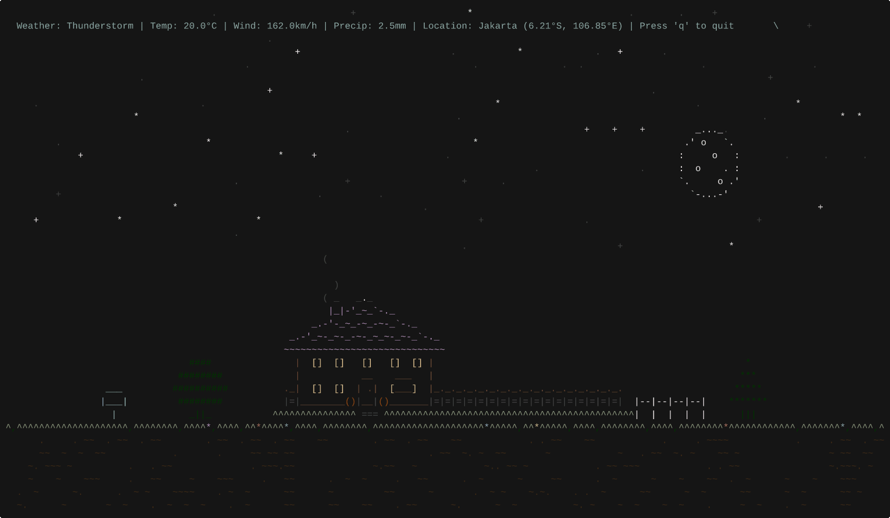
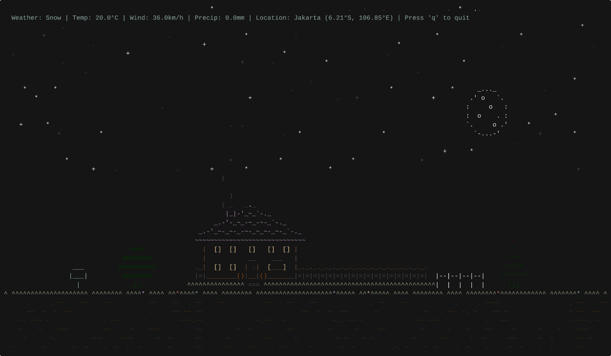

# weathr

[](https://crates.io/crates/weathr)
[](https://crates.io/crates/weathr)
[](https://github.com/veirt/weathr/blob/main/LICENSE)

A terminal weather app with ASCII animations driven by real-time weather data.

Features real-time weather from Open-Meteo with animated rain, snow, thunderstorms, flying airplanes, day/night cycles, auto-location detection, city name lookups, and city-specific ASCII skylines.

## Demo

|                                    Thunderstorm Night                                     |                             Snow                              |
| :---------------------------------------------------------------------------------------: | :-----------------------------------------------------------: |
|  |  |

## Contents

- [Installation](#installation)
- [Quick Start](#quick-start)
- [Configuration](#configuration)
- [Usage](#usage)
- [City Skylines](#city-skylines)
- [Shell Integration](#shell-integration)
- [Privacy](#privacy)
- [Roadmap](#roadmap)
- [License](#license)

## Installation

### Via Cargo

```bash
cargo install weathr
```

### Build from Source

You need Rust installed.

```bash
git clone https://github.com/veirt/weathr.git
cd weathr
cargo install --path .
```

## Quick Start

```bash
# Show weather for a city
weathr london

# Set a default city (saves to config)
weathr --set-default tokyo

# Run with defaults from config
weathr
```

## Configuration

The config file location depends on your platform:

- **Linux**: `~/.config/weathr/config.toml` (or `$XDG_CONFIG_HOME/weathr/config.toml`)
- **macOS**: `~/Library/Application Support/weathr/config.toml`

You can also place a `config.toml` in the current working directory, which takes priority over the default location.

### Setup

```bash
# Linux
mkdir -p ~/.config/weathr

# macOS
mkdir -p ~/Library/Application\ Support/weathr
```

Edit the config file at the appropriate path for your platform:

```toml
# Hide the HUD (Heads Up Display) with weather details
hide_hud = false

# Run silently without startup messages (errors still shown)
silent = false

[location]
# Location coordinates (overridden if auto = true)
latitude = 40.7128
longitude = -74.0060

# Auto-detect location via IP (defaults to true if config missing)
auto = false

# Hide the location name in the UI
hide = false

[units]
# Temperature unit: "celsius" or "fahrenheit"
temperature = "celsius"

# Wind speed unit: "kmh", "ms", "mph", or "kn"
wind_speed = "kmh"

# Precipitation unit: "mm" or "inch"
precipitation = "mm"
```

### Example Locations

```toml
# Tokyo, Japan
latitude = 35.6762
longitude = 139.6503

# Sydney, Australia
latitude = -33.8688
longitude = 151.2093
```

## Usage

Run with real-time weather:

```bash
weathr
```

### City Lookup

Look up weather by city name instead of coordinates:

```bash
# Weather for a specific city
weathr london
weathr new york
weathr san francisco

# Set a default city (saves to config file)
weathr --set-default paris

# Set default via IP auto-detection
weathr --set-default
```

The city name and country are displayed in the top-right corner of the terminal.

### CLI Options

Simulate weather conditions for testing:

```bash
# Simulate rain
weathr --simulate rain

# Simulate snow at night
weathr --simulate snow --night

# Clear day with falling leaves
weathr --simulate clear --leaves
```

Available weather conditions:

- Clear Skies: `clear`, `partly-cloudy`, `cloudy`, `overcast`
- Precipitation: `fog`, `drizzle`, `rain`, `freezing-rain`, `rain-showers`
- Snow: `snow`, `snow-grains`, `snow-showers`
- Storms: `thunderstorm`, `thunderstorm-hail`

Override configuration:

```bash
# Use imperial units (°F, mph, inch)
weathr --imperial

# Use metric units (°C, km/h, mm) - default
weathr --metric

# Auto-detect location via IP
weathr --auto-location

# Hide location coordinates
weathr --hide-location

# Hide status HUD
weathr --hide-hud

# Run silently (suppress non-error output)
weathr --silent

# Run for a specific duration then exit (in seconds)
weathr --duration 5

# Combine flags
weathr --imperial --auto-location
weathr london --duration 10
```

### Keyboard Controls

- `q` or `Q` - Quit
- `Ctrl+C` - Exit

### Environment Variables

The application respects several environment variables:

- `NO_COLOR` - When set, disables all color output (accessibility feature)
- `COLORTERM` - Detects truecolor support (values: "truecolor", "24bit")
- `TERM` - Used for terminal capability detection (e.g., "xterm-256color")

Examples:

```bash
# Disable colors for accessibility
NO_COLOR=1 weathr
```

## City Skylines

When looking up weather for supported cities, weathr displays a recognizable ASCII skyline instead of the default house scene. Supported cities:

- **London** — Big Ben, Parliament, London Eye
- **New York** — Empire State, Chrysler Building
- **Paris** — Eiffel Tower, Parisian rooflines
- **Tokyo** — Tokyo Tower, modern skyscrapers
- **Sydney** — Opera House, Harbour Bridge
- **Dubai** — Burj Khalifa, Burj Al Arab
- **San Francisco** — Golden Gate towers, Transamerica Pyramid
- **Rome** — Colosseum, St. Peter's dome

Unknown cities fall back to the default town scene with a house and decorations.

## Shell Integration

Add weathr to your shell startup so it displays briefly when you open a terminal:

```bash
# Add to your shell rc file (.zshrc, .bashrc, or config.fish)
weathr --install-shell

# Remove from your shell rc file
weathr --uninstall-shell
```

This adds `weathr --duration 5` to your shell config, which shows the weather for 5 seconds each time you open a new terminal.

## Privacy

### Location Detection

When using `auto = true` in config or the `--auto-location` flag, the application makes a request to `ipinfo.io` to detect your approximate location based on your IP address.

### City Geocoding

When using city name lookups (e.g. `weathr london`), the application queries the [Open-Meteo Geocoding API](https://open-meteo.com/en/docs/geocoding-api) to resolve city names to coordinates. No API key is required.

Both features are optional. You can manually specify coordinates in your config file to avoid any external API calls beyond weather data fetching.

## Roadmap

- [ ] Support for OpenWeatherMap, WeatherAPI, etc.
- [ ] Installation via AUR.
- [ ] Key bindings for manual refresh, speed up animations, pause animations, and toggle HUD.

## License

GPL-3.0-or-later

## Credits

### Weather Data

Weather data provided by [Open-Meteo.com](https://open-meteo.com/) under the [CC BY 4.0 license](https://creativecommons.org/licenses/by/4.0/).

### ASCII Art

- **Source**: https://www.asciiart.eu/
- **House**: Joan G. Stark
- **Airplane**: Joan G. Stark
- **Sun**: Hayley Jane Wakenshaw (Flump)
- **Moon**: Joan G. Stark
- **City Skylines**: Hand-crafted for this project

_Note: If any ASCII art is uncredited or misattributed, it belongs to the original owner._
